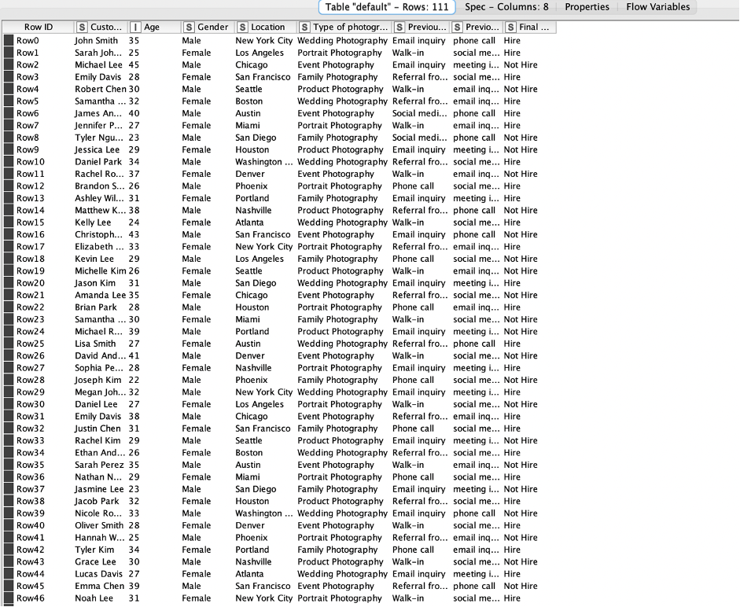

#  codeless-AI-ML-2022-project
## Introduction
ไฟล์ csv ใช้สำหรับบันทึกข้อมูลของคนจ้างงานถ่ายรูปโดยระบุชื่อเพศอายุสถานที่รูปแบบงานและช่องทางการติดต่อ ข้อมูลที่ได้เอามาจากอินเตอเน็ตและวิเคราะห์ข้อมูลในโปรแกรม KNIME 

##Construction
ในการวิเคราะห์ในโปรแกรม KNIME โดยใช้ 3 โมเดล Decision tree Learner, Naive bayes Learner และ Gradient boosted trees Learner ในการวิเคราะห์นี้ได้ผลลัพธ์มากที่สุด คือ โมเดล Decision tree Learner : 60.87 % 
คนที่จะถ่ายรูปเป็นส่วนมากจะเป็นผู้หญิง อยู่ในช่วงอายุ 28 ปี ส่วนมากจะถ่ายแบบงานแต่ง ช่วงการติดต่อส่วนเป็นการติดต่อแบบเข้ามาพุดคุยที่ร้านเอง

